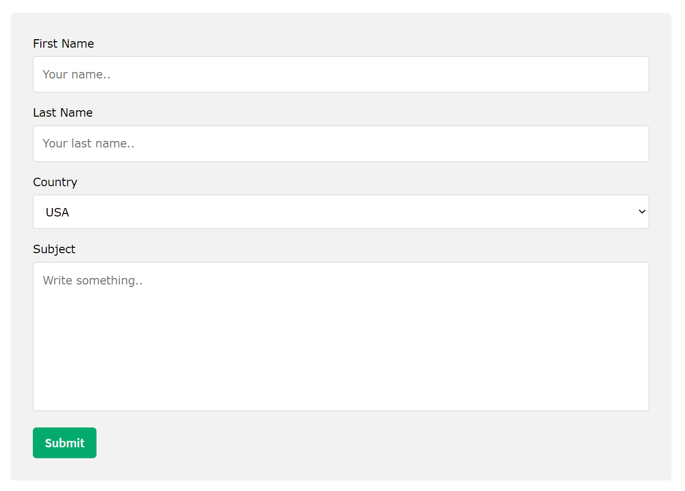

# QA-utilities

*There are my developments for useful utilities in software testing.*

> **The idea is simple - we need tools for filling out forms and generating data.**

For testing web applications we have extensions like [Bug magnet](https://github.com/gojko/bugmagnet) or [Fake Data](https://www.fakedata.pro/)

But what if we fill in the data **outside the web browser**? In Desktop applications, or databases, or anywhere else...

I decided to reinvent the bicycle and write some scripts *to get data generator wherever I want*.

For scripting i used Python and for calling these sripts i use text-expander [Espanso](https://github.com/espanso/espanso) because of FOSS and multiplatform.

## String Generator

* Put `.yaml` file in espanso directory and `.py` file in `/scripts` folder

* Then, just type abbreviation `:genstr` and write numbers into input form

## Multiple fields filling out

* comming soon

## Fake Data Generation

* commming soon
